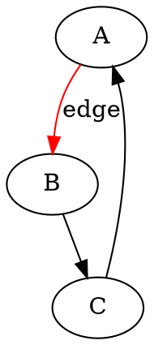

# Graphviz - Technical Deep Dive

## Architecture

### Dual-Layer Design
- **Core:** Graphviz C libraries (dot, neato, fdp, sfdp, circo, twopi)
- **Python bindings:** Thin wrapper generating DOT language strings
- **Rendering:** System-installed Graphviz processes DOT → output formats
- **Data flow:** Python → DOT text → Graphviz binary → PNG/SVG/PDF

### DOT Language


**Key insight:** Python library is primarily a DOT string builder, not a graph renderer.

## Performance Characteristics

### Scaling Limits
- **Practical limit:** 100K+ nodes (tested on large dependency graphs)
- **Edge limit:** 500K+ edges (limited by memory, not algorithm)
- **Memory:** ~1-2GB for 100K node graph

### Layout Algorithm Performance

| Engine | Algorithm | Complexity | Best For |
|--------|-----------|------------|----------|
| dot | Hierarchical (Sugiyama) | O(n + e) | DAGs, flowcharts |
| neato | Spring model (Kamada-Kawai) | O(n²) | Small undirected graphs |
| fdp | Force-directed (Fruchterman-Reingold) | O(n² log n) | General undirected |
| sfdp | Multiscale force-directed | O(n log n) | Large graphs (>1K nodes) |
| circo | Circular | O(n) | Cyclic structures |
| twopi | Radial | O(n) | Tree with root |

**Performance winner:** `sfdp` for large graphs (scalable force-directed placement).

### Rendering Speed
- **dot (10K nodes):** 5-10 seconds to SVG
- **sfdp (100K nodes):** 30-60 seconds to PNG
- **Deterministic:** Same input always produces same layout

## API Design

### Python API (graphviz package)
```python
from graphviz import Digraph

g = Digraph('G', format='png')
g.node('A', label='Node A', shape='box')
g.edge('A', 'B', label='connects to')
g.render('output')
```

**Limitations:**
- No graph analysis (use NetworkX for algorithms)
- No layout control (Graphviz decides positions)
- Limited error messages (DOT syntax errors are cryptic)

### DOT Language Mastery
For advanced layouts, learning DOT is essential:
- Subgraphs and clusters
- Rank constraints (same/min/max/source/sink)
- Edge routing (spline types)
- Node shapes (record, Mrecord for UML)

**Learning curve:** Moderate (declarative syntax differs from imperative Python).

## Layout Algorithms Deep Dive

### dot (Hierarchical)
- **Algorithm:** Sugiyama framework (layer assignment, crossing reduction, positioning)
- **Best for:** Directed graphs with clear hierarchy
- **Output:** Top-to-bottom or left-to-right ranks
- **Tuning:** `rankdir`, `ranksep`, `nodesep` attributes

### sfdp (Scalable Force-Directed)
- **Algorithm:** Multilevel force-directed with Barnes-Hut
- **Best for:** Large undirected graphs (social networks)
- **Output:** Natural clustering of communities
- **Tuning:** `K` (spring constant), `maxiter`, `overlap`

### neato (Geometric)
- **Algorithm:** Virtual physical model with spring embedders
- **Best for:** Small graphs (<200 nodes) requiring symmetric layout
- **Output:** Minimizes edge crossings
- **Tuning:** `start` (random seed for reproducibility)

## Styling Capabilities

### Node Shapes
- **Basic:** box, circle, ellipse, diamond
- **Specialized:** record (tables), Mrecord (rounded tables)
- **Custom:** polygon with sides/skew/distortion
- **Images:** External PNG/SVG as node shapes

### Edge Routing
- **Splines:** true (curved), false (straight), ortho (orthogonal), polyline
- **Arrows:** normal, dot, odot, inv, diamond (20+ types)
- **Penwidth:** Edge thickness (supports fractional values)

### Colors and Styles
- **Color schemes:** X11 names, RGB hex, HSV
- **Gradients:** Linear gradients with `fillcolor`
- **Transparency:** Alpha channel support in SVG output
- **Styles:** solid, dashed, dotted, bold, invisible

## Advanced Features

### Subgraph Clusters
```python
with g.subgraph(name='cluster_0') as c:
    c.attr(label='Cluster A', style='filled', color='lightgrey')
    c.node('A1')
    c.node('A2')
```

**Effect:** Visual grouping with background box.

### Rank Constraints
```python
g.attr(rankdir='LR')  # Left-to-right instead of top-down
g.attr('node', shape='box')  # Default for all nodes
```

**Use case:** Control global layout direction and defaults.

### HTML-Like Labels
```python
label = '<<TABLE><TR><TD>Field1</TD><TD>Value1</TD></TR></TABLE>>'
g.node('A', label=label)
```

**Power:** Create UML-like diagrams with structured labels.

## Integration Patterns

### NetworkX → Graphviz
```python
from networkx.drawing.nx_agraph import write_dot
write_dot(G, 'graph.dot')
# Or: pygraphviz (NetworkX extension)
```

**Workflow:** Analyze with NetworkX, render with Graphviz.

### Pandas → Graphviz
```python
# From edge list dataframe
for _, row in df.iterrows():
    g.edge(row['source'], row['target'])
```

**Use case:** Database query results → dependency diagrams.

## Output Formats

### Vector Formats
- **SVG:** Web-compatible, scalable, supports links
- **PDF:** Publication-quality, embeddable in LaTeX
- **PostScript:** Legacy print workflows

### Raster Formats
- **PNG:** Web images, documentation
- **JPEG:** Lossy compression (avoid for diagrams)
- **GIF:** Animated graphs (manual frame generation)

### Data Formats
- **DOT:** Re-import, version control
- **JSON:** Programmatic processing
- **Plain:** Text-based positions (for custom rendering)

## Ecosystem Position

**Embedded in:**
- Sphinx (Python documentation generator)
- Doxygen (C/C++ documentation)
- PlantUML (UML diagram tool)
- Airflow (workflow DAG visualization)

**Alternative to:**
- mermaid.js (Markdown-based diagrams)
- D3.js (custom JavaScript layouts)
- Gephi (interactive desktop tool)

## When Graphviz Shines

✅ **Ideal scenarios:**
- Software architecture diagrams (call graphs, dependencies)
- Automated documentation generation
- Hierarchical data visualization (org charts, file systems)
- Reproducible scientific figures (deterministic layouts)

❌ **Poor fit:**
- Interactive exploration (static output only)
- Real-time data (slow re-render)
- Custom physics simulations (layout algorithms are fixed)
- Beginner-friendly tools (learning curve for DOT)

## Production Considerations

### System Dependencies
- Requires Graphviz installation (apt, brew, choco)
- Docker images often exclude Graphviz (add to Dockerfile)
- Version mismatches can cause rendering differences

### CI/CD Integration
```bash
# Install in CI pipeline
apt-get install -y graphviz
pip install graphviz
```

**Caution:** Graphviz versions have breaking changes - pin versions.

### Performance Tuning
For large graphs:
- Use `sfdp` instead of `neato`
- Disable splines: `splines=false` (faster rendering)
- Reduce DPI for PNG: `dpi=72`
- Split into multiple diagrams (cluster-per-file)
